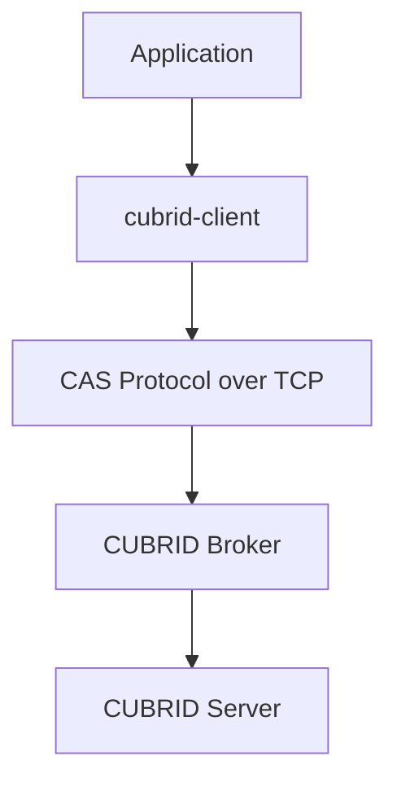
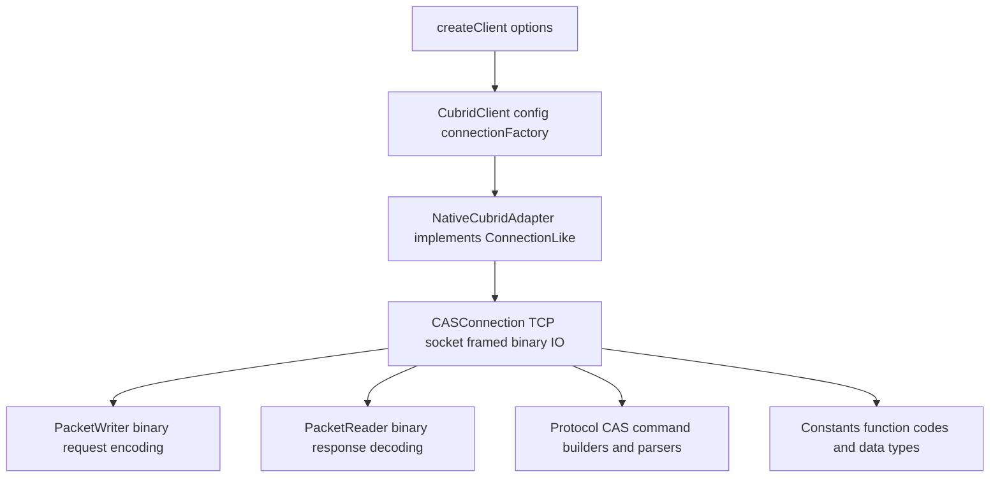
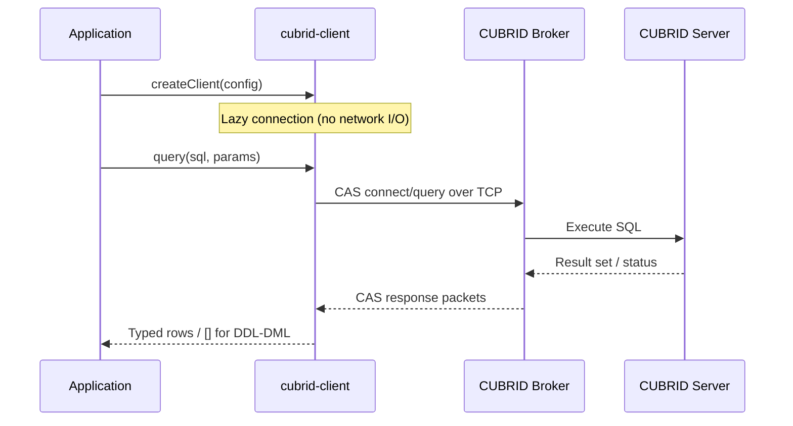
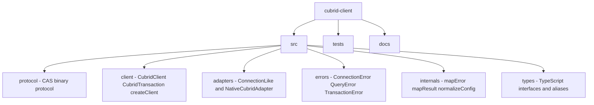

# cubrid-client

**Modern TypeScript-first Node.js client for the CUBRID database** — zero native dependencies, built-in CAS protocol driver, Promise-based API with full type safety.

<!-- BADGES:START -->
[](https://www.npmjs.com/package/cubrid-client)
[](https://nodejs.org)
[](https://github.com/cubrid-labs/cubrid-client/actions/workflows/ci.yml)
[](https://codecov.io/gh/cubrid-labs/cubrid-client)
[](https://github.com/cubrid-labs/cubrid-client/blob/main/LICENSE)
[](https://github.com/cubrid-labs/cubrid-client)
<!-- BADGES:END -->

## Why cubrid-client?

A modern CUBRID client that speaks the CAS binary protocol directly over TCP — no legacy driver dependencies, no native bindings.

| Feature | cubrid-client |
|---------|---------------|
| Protocol | Native CAS binary over TCP |
| Dependencies | Zero runtime dependencies |
| API style | Pure async/await |
| TypeScript | Full generics (`query<T>()`) |
| Results | `Record<string, unknown>[]` objects |
| Errors | `ConnectionError`, `QueryError`, `TransactionError` |
| Transactions | `transaction(callback)` with auto commit/rollback |
| Node.js | 18+ |

## Installation

```bash
npm install cubrid-client
```

No peer dependencies required.

**Requirements**: Node.js 18+, CUBRID 10.2+

## Quick Start

```ts
import { createClient } from "cubrid-client";

const db = createClient({
  host: "localhost",
  port: 33000,
  database: "demodb",
  user: "dba",
  password: "",
});

// Query returns an array of row objects
const rows = await db.query("SELECT * FROM athlete LIMIT 5");
console.log(rows);
// [{ code: 10000, name: 'Fernandez', ... }, ...]

await db.close();
```

## Typed Queries

Use TypeScript generics to get fully typed query results:

```ts
type Athlete = {
  code: number;
  name: string;
  gender: string;
  nation_code: string;
  event: string;
};

const athletes = await db.query<Athlete>(
  "SELECT * FROM athlete WHERE nation_code = ? LIMIT ?",
  ["KOR", 10],
);
// athletes is Athlete[] — full autocompletion and type safety
```

## Parameterized Queries

Use `?` placeholders to safely pass parameters:

```ts
// Positional parameters
const users = await db.query(
  "SELECT * FROM users WHERE name = ? AND age > ?",
  ["Alice", 25],
);

// Supported parameter types
await db.query("INSERT INTO data (a, b, c, d, e, f, g) VALUES (?, ?, ?, ?, ?, ?, ?)", [
  "text",              // string
  42,                  // number
  true,                // boolean
  9007199254740993n,   // bigint
  new Date(),          // Date
  Buffer.from("bin"),  // Buffer
  null,                // null
]);
```

## Transactions

### Automatic (Recommended)

`transaction()` creates an isolated connection, auto-commits on success, and auto-rolls back on error:

```ts
await db.transaction(async (tx) => {
  await tx.query("INSERT INTO orders (item, qty) VALUES (?, ?)", ["Widget", 1]);
  await tx.query(
    "UPDATE inventory SET qty = qty - 1 WHERE item = ?",
    ["Widget"],
  );
  // Auto-committed here
});
// If any query throws, everything is rolled back automatically.
```

### Manual

For fine-grained control on the shared connection:

```ts
await db.beginTransaction();
try {
  await db.query("INSERT INTO logs (msg) VALUES (?)", ["step 1"]);
  await db.query("INSERT INTO logs (msg) VALUES (?)", ["step 2"]);
  await db.commit();
} catch (error) {
  await db.rollback();
  throw error;
}
```

## Error Handling

Every error includes the original driver error as `.cause`:

```ts
import { createClient, ConnectionError, QueryError, TransactionError } from "cubrid-client";

const db = createClient({ host: "localhost", database: "demodb", user: "dba" });

try {
  await db.query("SELECT * FROM nonexistent_table");
} catch (error) {
  if (error instanceof ConnectionError) {
    console.error("Connection failed:", error.message);
  } else if (error instanceof QueryError) {
    console.error("Query failed:", error.message);
    console.error("Driver error:", error.cause);
  } else if (error instanceof TransactionError) {
    console.error("Transaction failed:", error.message);
  }
}
```

## API Reference

### `createClient(options): CubridClient`

Creates a client instance. Connection is established lazily on first query.

| Option | Type | Default | Description |
|--------|------|---------|-------------|
| `host` | `string` | *(required)* | Server hostname |
| `port` | `number` | `33000` | Broker port |
| `database` | `string` | *(required)* | Database name |
| `user` | `string` | *(required)* | Database user |
| `password` | `string` | `""` | Password |
| `connectionTimeout` | `number` | — | Connection timeout (ms) |

### `client.query<T>(sql, params?): Promise<T[]>`

Executes SQL and returns typed row objects. DDL/DML statements return `[]`.

### `client.transaction<T>(callback): Promise<T>`

Runs `callback` in an isolated transaction with auto commit/rollback.

### `client.beginTransaction(): Promise<void>`

Starts a transaction on the shared connection.

### `client.commit(): Promise<void>`

Commits the active transaction on the shared connection.

### `client.rollback(): Promise<void>`

Rolls back the active transaction on the shared connection.

### `client.close(): Promise<void>`

Closes the shared connection. Safe to call multiple times.

> 📖 Full API documentation: [docs/API_REFERENCE.md](docs/API_REFERENCE.md)

## Architecture

`cubrid-client` implements the CUBRID CAS binary protocol directly over TCP sockets:







No external protocol drivers needed — the entire CAS handshake, query execution, and result parsing is implemented in TypeScript.

## Documentation

| Document | Description |
|----------|-------------|
| [API Reference](docs/API_REFERENCE.md) | Complete method signatures, type definitions, error classes |
| [Connection Guide](docs/CONNECTION.md) | Connection options, lazy connection, lifecycle, Docker setup |
| [Troubleshooting](docs/TROUBLESHOOTING.md) | Common errors, debugging tips, performance advice |
| [Architecture](docs/architecture.md) | Internal design and module responsibilities |

## Project Layout



## Development

```bash
git clone https://github.com/cubrid-labs/cubrid-client.git
cd cubrid-client
npm install
npm run build        # TypeScript compilation (tsup)
npm test             # Run offline tests
npm run test:coverage # Coverage report (99%+ statements)
npm run typecheck    # tsc --noEmit
```

### Integration Tests

```bash
docker compose up -d                  # Start CUBRID
npm run test:integration              # Run against live DB
docker compose down -v                # Cleanup
```

## Ecosystem

| Package | Description |
|---------|-------------|
| [cubrid-client](https://github.com/cubrid-labs/cubrid-client) | TypeScript client (this package) |
| [drizzle-cubrid](https://github.com/cubrid-labs/drizzle-cubrid) | Drizzle ORM dialect for CUBRID |

## Roadmap

See [`ROADMAP.md`](ROADMAP.md) for this project's direction and next milestones.

For the ecosystem-wide view, see the [CUBRID Labs Ecosystem Roadmap](https://github.com/cubrid-labs/.github/blob/main/ROADMAP.md) and [Project Board](https://github.com/orgs/cubrid-labs/projects/2).

## License

[MIT](LICENSE)
