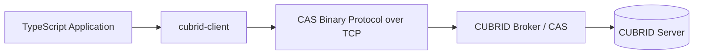
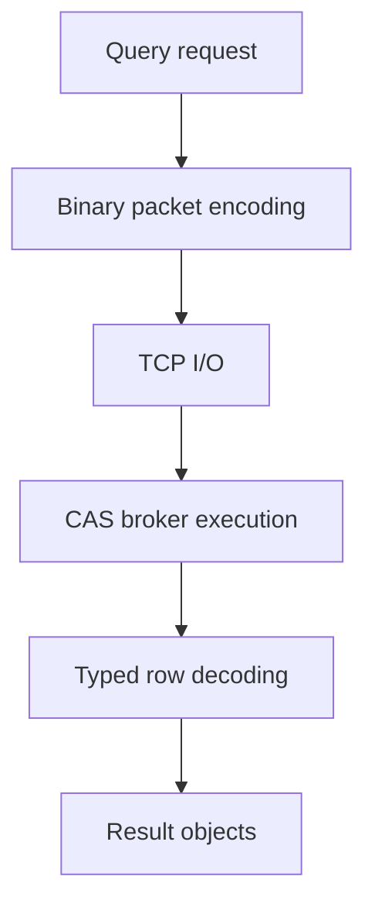
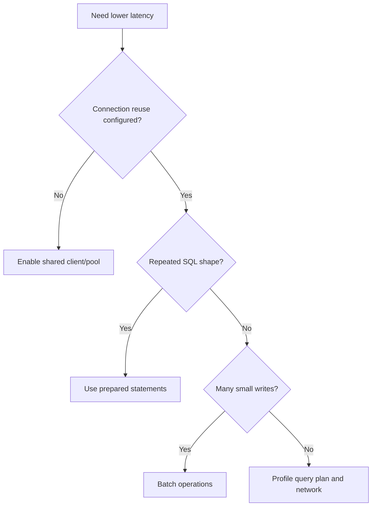

# Performance Guide

This document summarizes `cubrid-client` benchmark behavior and practical tuning guidance.

## Overview

`cubrid-client` is a TypeScript driver that talks directly to CUBRID via CAS binary protocol.

## Benchmark Results

Source: [cubrid-benchmark](https://github.com/cubrid-labs/cubrid-benchmark)

Environment: Intel Core i5-9400F @ 2.90GHz, 6 cores, Linux x86_64, Docker containers.

Workload: TypeScript `cubrid-client` vs `mysql2`, 100 rows x 3 rounds.

| Scenario | CUBRID (cubrid-client) | MySQL (mysql2) | Ratio (CUBRID/MySQL) |
|---|---:|---:|---:|
| insert_sequential | 6.18s | 14.85s | 0.4x |
| select_by_pk | 6.57s | 13.89s | 0.5x |
| select_full_scan | 5.60s | 14.71s | 0.4x |
| update_indexed | 6.32s | 14.87s | 0.4x |

In this benchmark shape, CUBRID is faster than MySQL in every tested TypeScript scenario.

## Performance Characteristics

- Direct CAS binary protocol implementation keeps request/response handling efficient.
- Driver design minimizes intermediate allocations in hot encode/decode paths.
- Stable latency appears on mixed read/write micro-benchmarks.
- Performance is sensitive to round-trip count when workloads are highly chatty.

## Optimization Tips

- Reuse a single client/pool per process instead of reconnecting per request.
- Batch writes when possible to reduce CAS round-trips.
- Use prepared statements for repeated query shapes.
- Keep payload size lean by selecting only required columns.

## Running Benchmarks

1. Clone `https://github.com/cubrid-labs/cubrid-benchmark`.
2. Start Docker-based benchmark databases as described in the repo.
3. Run the TypeScript suite for `cubrid-client` and `mysql2`.
4. Use 100 rows x 3 rounds for parity with the published results.
5. Export timing tables and compare ratio trends across scenarios.

Use the benchmark repo scripts and README for exact execution commands.
